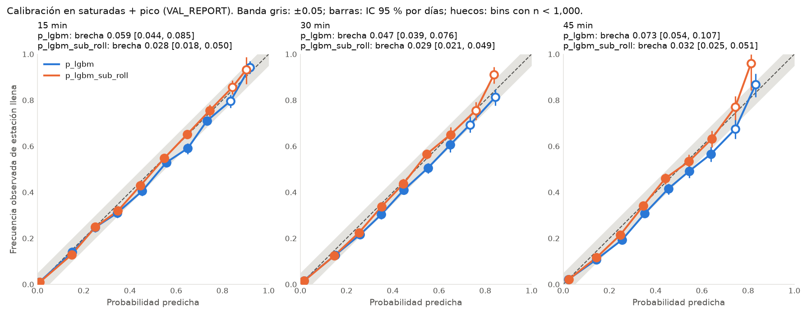

# M6: LightGBM, primer modelo

Fecha: 2026-10-06. Reproducible con `uv run python -m ecobici.eval.model_report`: 6.7 min para los 3 horizontes en 14 núcleos (incluido el bootstrap), con 17.5 GB de RAM como máximo y DuckDB limitado a 10 GB. **Determinista:** dos corridas dan exactamente los mismos números.

## Protocolo

- **Datos:** entrenamiento 2024-09 → 2025-06 (~16.9 M ejemplos por horizonte). Parada temprana y calibración isotónica en **VAL_FIT** (2025-08, 2025-09). Las métricas salen de **VAL_REPORT** (2025-10 → 2025-12). **Los meses de prueba no se leen.**
- **Modelos:**
  - `p_lgbm`: el modelo **fijado de antemano**, con una sola calibración en VAL_FIT;
  - `p_lgbm_recal`: el mismo booster con recalibración isotónica semanal sobre los 28 días anteriores. Lo agregué al ver la calibración; es exploratorio.
  - `p_lgbm_sub` y `p_lgbm_sub_roll`: `p_lgbm` con una segunda calibración (Platt) solo en saturadas + pico, fija o semanal. **`p_lgbm_sub_roll` es el modelo congelado para la prueba final** ([calibración por subgrupo](#calibración-por-subgrupo-2026-10-06)).
- **Variables (33):**
  - estación y capacidad;
  - estado actual y de hace 15/30/60 min;
  - vecinas a ≤ 300 m;
  - hora, día, feriado y tipo de día de llegada;
  - lluvia y temperatura (Open-Meteo), ahora y la próxima hora;
  - flujo histórico de viajes (M4) en la franja de llegada y entre *t* y la llegada;
  - perfil de la estación.
  Todos los históricos se ajustan solo con entrenamiento.

## Resultado principal: saturadas en el pico (el caso del producto)

| Horizonte | Mejor línea base (persistencia calibrada) | `p_lgbm` | **BSS** |
| --- | --- | --- | --- |
| 15 min | 0.0902 | 0.0707 | **+0.216** |
| 30 min | 0.1096 | 0.0857 | **+0.218** |
| 45 min | 0.1176 | 0.0934 | **+0.205** |

En todos los cortes (todas las estaciones, pico, saturadas, saturadas + pico) y horizontes, el BSS va de **+0.17 a +0.22**.

## Comparación justa e intervalos de confianza (2026-10-06)

Pasos 1 y 2 de [`next_steps.md`](../next_steps.md). Mismo modelo, mismos datos; solo cambian las referencias y se agregan intervalos.

**Líneas base con los mismos datos que el modelo.** El modelo usa VAL_FIT (2025-08, 2025-09) para la parada temprana y la calibración; las líneas base fijadas de antemano solo ven TRAIN. Se agregaron dos versiones de `p_persist_cal` y `p_hist`:
- `_tvf`: reajustadas con TRAIN + VAL_FIT;
- `_iso`: ajustadas con TRAIN y recalibradas con isotónica en VAL_FIT, el mismo paso que el modelo.

La "referencia justa" es la mejor de las siete líneas base en cada corte. Mejora a la mejor original en **≤ 0.2 % de Brier**, y el BSS del modelo baja **como mucho 0.002**. En saturadas + pico no cambia (+0.216 / +0.218 / +0.205). **Casi todo el ~20 % viene del modelo**, no de ver datos más recientes.

**Bootstrap por bloques** (`ecobici.eval.bootstrap`, 1,000 réplicas, IC 95 % por percentiles). Dos tipos de bloque:
- **día** (66–92 bloques): conserva los choques de todo el sistema (lluvia, feriados);
- **estación × día** (7 k–62 k bloques): supone estaciones independientes dentro de un día.

Los intervalos por día salen **~2 veces más anchos**, así que la correlación entre estaciones en un mismo día es real. **Los intervalos por día son los de referencia.**

BSS de `p_lgbm` en saturadas + pico, contra la referencia justa:

| Horizonte | BSS | IC 95 % (días) | IC 95 % (estación × día) |
| --- | --- | --- | --- |
| 15 min | +0.216 | [+0.202, +0.230] | [+0.207, +0.225] |
| 30 min | +0.218 | [+0.197, +0.236] | [+0.208, +0.228] |
| 45 min | +0.205 | [+0.180, +0.227] | [+0.194, +0.217] |

El límite inferior queda lejos de 0 y del +0.10 de la meta en todos los cortes y horizontes (el más bajo: +0.156, saturadas a 45 min).

**Log loss** (saturadas + pico, modelo frente a la mejor línea base): 0.217 vs 0.342 a 15 min, 0.268 vs 0.408 a 30 min, 0.298 vs 0.437 a 45 min. Una reducción de ~35 %, mayor que la del Brier: la persistencia calibrada da probabilidades casi nulas a estaciones que sí se llenan, y el log loss lo castiga más.

## Metas

| Horizon | Modelo | Meta | Valor | ¿Cumple? |
|---|---|---|---|---|
| 15 min | p_lgbm | BSS > 0, all | 0.183 | ✅ |
| 15 min | p_lgbm_recal | BSS > 0, all | 0.182 | ✅ |
| 15 min | p_lgbm_sub | BSS > 0, all | 0.183 | ✅ |
| 15 min | p_lgbm_sub_roll | BSS > 0, all | 0.183 | ✅ |
| 15 min | p_lgbm | BSS > 0, peak | 0.208 | ✅ |
| 15 min | p_lgbm_recal | BSS > 0, peak | 0.208 | ✅ |
| 15 min | p_lgbm_sub | BSS > 0, peak | 0.210 | ✅ |
| 15 min | p_lgbm_sub_roll | BSS > 0, peak | 0.211 | ✅ |
| 15 min | p_lgbm | BSS > 0, saturated | 0.178 | ✅ |
| 15 min | p_lgbm_recal | BSS > 0, saturated | 0.178 | ✅ |
| 15 min | p_lgbm_sub | BSS > 0, saturated | 0.179 | ✅ |
| 15 min | p_lgbm_sub_roll | BSS > 0, saturated | 0.179 | ✅ |
| 15 min | p_lgbm | BSS > 0, saturated_peak | 0.216 | ✅ |
| 15 min | p_lgbm_recal | BSS > 0, saturated_peak | 0.216 | ✅ |
| 15 min | p_lgbm_sub | BSS > 0, saturated_peak | 0.219 | ✅ |
| 15 min | p_lgbm_sub_roll | BSS > 0, saturated_peak | 0.219 | ✅ |
| 15 min | p_lgbm | calibration gap <= 0.05, saturated_peak | 0.059 | ❌ |
| 15 min | p_lgbm_recal | calibration gap <= 0.05, saturated_peak | 0.047 | ✅ |
| 15 min | p_lgbm_sub | calibration gap <= 0.05, saturated_peak | 0.035 | ✅ |
| 15 min | p_lgbm_sub_roll | calibration gap <= 0.05, saturated_peak | 0.028 | ✅ |
| 30 min | p_lgbm | BSS > 0, all | 0.196 | ✅ |
| 30 min | p_lgbm_recal | BSS > 0, all | 0.196 | ✅ |
| 30 min | p_lgbm_sub | BSS > 0, all | 0.197 | ✅ |
| 30 min | p_lgbm_sub_roll | BSS > 0, all | 0.197 | ✅ |
| 30 min | p_lgbm | BSS > 0, peak | 0.210 | ✅ |
| 30 min | p_lgbm_recal | BSS > 0, peak | 0.210 | ✅ |
| 30 min | p_lgbm_sub | BSS > 0, peak | 0.212 | ✅ |
| 30 min | p_lgbm_sub_roll | BSS > 0, peak | 0.213 | ✅ |
| 30 min | p_lgbm | BSS > 0, saturated | 0.180 | ✅ |
| 30 min | p_lgbm_recal | BSS > 0, saturated | 0.180 | ✅ |
| 30 min | p_lgbm_sub | BSS > 0, saturated | 0.181 | ✅ |
| 30 min | p_lgbm_sub_roll | BSS > 0, saturated | 0.182 | ✅ |
| 30 min | p_lgbm | BSS > 0, saturated_peak | 0.218 | ✅ |
| 30 min | p_lgbm | BSS >= 0.1, saturated_peak | 0.218 | ✅ |
| 30 min | p_lgbm_recal | BSS > 0, saturated_peak | 0.218 | ✅ |
| 30 min | p_lgbm_recal | BSS >= 0.1, saturated_peak | 0.218 | ✅ |
| 30 min | p_lgbm_sub | BSS > 0, saturated_peak | 0.221 | ✅ |
| 30 min | p_lgbm_sub | BSS >= 0.1, saturated_peak | 0.221 | ✅ |
| 30 min | p_lgbm_sub_roll | BSS > 0, saturated_peak | 0.222 | ✅ |
| 30 min | p_lgbm_sub_roll | BSS >= 0.1, saturated_peak | 0.222 | ✅ |
| 30 min | p_lgbm | calibration gap <= 0.05, saturated_peak | 0.047 | ✅ |
| 30 min | p_lgbm_recal | calibration gap <= 0.05, saturated_peak | 0.051 | ❌ |
| 30 min | p_lgbm_sub | calibration gap <= 0.05, saturated_peak | 0.038 | ✅ |
| 30 min | p_lgbm_sub_roll | calibration gap <= 0.05, saturated_peak | 0.029 | ✅ |
| 45 min | p_lgbm | BSS > 0, all | 0.196 | ✅ |
| 45 min | p_lgbm_recal | BSS > 0, all | 0.196 | ✅ |
| 45 min | p_lgbm_sub | BSS > 0, all | 0.196 | ✅ |
| 45 min | p_lgbm_sub_roll | BSS > 0, all | 0.196 | ✅ |
| 45 min | p_lgbm | BSS > 0, peak | 0.196 | ✅ |
| 45 min | p_lgbm_recal | BSS > 0, peak | 0.196 | ✅ |
| 45 min | p_lgbm_sub | BSS > 0, peak | 0.201 | ✅ |
| 45 min | p_lgbm_sub_roll | BSS > 0, peak | 0.202 | ✅ |
| 45 min | p_lgbm | BSS > 0, saturated | 0.173 | ✅ |
| 45 min | p_lgbm_recal | BSS > 0, saturated | 0.172 | ✅ |
| 45 min | p_lgbm_sub | BSS > 0, saturated | 0.174 | ✅ |
| 45 min | p_lgbm_sub_roll | BSS > 0, saturated | 0.175 | ✅ |
| 45 min | p_lgbm | BSS > 0, saturated_peak | 0.205 | ✅ |
| 45 min | p_lgbm_recal | BSS > 0, saturated_peak | 0.205 | ✅ |
| 45 min | p_lgbm_sub | BSS > 0, saturated_peak | 0.211 | ✅ |
| 45 min | p_lgbm_sub_roll | BSS > 0, saturated_peak | 0.213 | ✅ |
| 45 min | p_lgbm | calibration gap <= 0.05, saturated_peak | 0.073 | ❌ |
| 45 min | p_lgbm_recal | calibration gap <= 0.05, saturated_peak | 0.084 | ❌ |
| 45 min | p_lgbm_sub | calibration gap <= 0.05, saturated_peak | 0.047 | ✅ |
| 45 min | p_lgbm_sub_roll | calibration gap <= 0.05, saturated_peak | 0.032 | ✅ |

## Calibración: lo que faltaba

Brecha de calibración de `p_lgbm` (el modelo fijado de antemano) en saturadas + pico, con IC 95 %:

| Horizonte | Brecha | IC 95 % (días) | IC 95 % (estación × día) | Réplicas ≤ 0.05 |
| --- | --- | --- | --- | --- |
| 15 min | 0.059 | [0.044, 0.085] | [0.046, 0.081] | 11 % |
| 30 min | 0.047 | [0.039, 0.076] | [0.042, 0.068] | 26 % |
| 45 min | 0.073 | [0.054, 0.107] | [0.059, 0.102] | 1 % |

- **0.047 contra 0.059 no es una diferencia real:** los intervalos se traslapan casi por completo. El ✅ de 30 min no es robusto, porque solo una de cada cuatro réplicas cumple la meta. A 45 min falla con claridad.
- La brecha es el máximo sobre los bins, así que el bootstrap la sesga hacia arriba y el intervalo es conservador. Aun así, la lectura no cambia.
- **Lo que sí es real es el sesgo:** a 30 y 45 min, todos los bins entre 0.1 y 0.8 quedan por debajo de la diagonal, y sus intervalos no la tocan. A 15 min pasa lo mismo de 0.3 a 0.9; de 0.1 a 0.3 está bien calibrado. El modelo sobreestima de forma sistemática en este subgrupo, y eso justifica la calibración por subgrupo (paso 3).

- **En todas las estaciones está casi perfecta:** ECE de 0.0004–0.0016, sin brecha relevante entre centro y periferia (V8 ✅).
- **Dentro de saturadas + pico, el modelo sobreestima** de 3 a 7 puntos en los rangos intermedios (0.1–0.8). La meta de ±0.05 se cumple a 30 min (0.047) y falla a 15 min (0.059) y a 45 min (0.073).
- **La recalibración móvil no lo resuelve** (15: 0.047 ✅; 30: 0.051 ❌; 45: 0.084 ❌). No es deriva en el tiempo.
- **Diagnóstico:** el calibrador isotónico se ajusta sobre todos los ejemplos, y el 97 % son casos fáciles de "no se llena". Por eso no corrige el subgrupo donde se concentra el riesgo. Es un problema de **calibración por subgrupo**.
- **Siguiente paso:** calibrar por separado el subgrupo pico + saturadas. Hecho en la sección siguiente.

## Calibración por subgrupo (2026-10-06)

Paso 3 de [`next_steps.md`](../next_steps.md). El booster y la isotónica global no cambian. Solo las filas de saturadas + pico (llegada entre semana 08:30–10:30 a una de las estaciones saturadas en TRAIN, ambas cosas conocidas al predecir) reciben una segunda calibración sobre `p_lgbm`:

- **`p_lgbm_sub`:** Platt, σ(a · logit(p) + b), ajustado una vez con las filas del subgrupo en VAL_FIT (~39 k por horizonte). Se guarda en `artifacts/platt_sub_{h}.json`.
- **`p_lgbm_sub_roll`:** el mismo Platt, reajustado cada semana con las filas del subgrupo de los 28 días anteriores (como `p_lgbm_recal`, pero solo en el subgrupo). Si la ventana tiene menos de 5,000 filas (~1.5 semanas de picos), usa `p_lgbm_sub`.

**Por qué hacen falta las dos partes.** El sesgo tiene dos componentes:
- **Del subgrupo:** en VAL_FIT, `p_lgbm` ya sobreestima ~2 puntos en los bins intermedios. La isotónica global no lo ve porque el 97 % de sus filas son casos fáciles.
- **De la temporada:** en VAL_REPORT el sesgo crece a 4–6 puntos, peor en diciembre, y la tasa de "llena" del subgrupo baja de 0.186 a 0.148. Un calibrador fijo en agosto–septiembre no puede corregir eso.

La recalibración semanal global (`p_lgbm_recal`) no ayudaba porque mezclaba las dos cosas con el resto de las estaciones. Hecha solo en el subgrupo, sí.

**Resultados en saturadas + pico (VAL_REPORT, IC 95 % por días):**

| Horizonte | `p_lgbm` | `p_lgbm_sub` | **`p_lgbm_sub_roll`** | BSS `p_lgbm` → `p_lgbm_sub_roll` |
| --- | --- | --- | --- | --- |
| 15 min | 0.059 [0.044, 0.085] | 0.035 [0.023, 0.059] | **0.028 [0.018, 0.050]** | +0.216 → +0.219 [+0.205, +0.232] |
| 30 min | 0.047 [0.039, 0.076] | 0.038 [0.026, 0.058] | **0.029 [0.021, 0.049]** | +0.218 → +0.222 [+0.204, +0.238] |
| 45 min | 0.073 [0.054, 0.107] | 0.047 [0.034, 0.072] | **0.032 [0.025, 0.051]** | +0.205 → +0.213 [+0.192, +0.231] |

- **El punto cumple en los tres horizontes con las dos versiones.** Con el IC por días, solo `p_lgbm_sub_roll` queda en el límite: 0.050, 0.049 y 0.051. Entre 97 % y 98 % de las réplicas cumplen la meta. El IC está sesgado hacia arriba (la brecha es un máximo sobre bins), así que se lee como un cumplimiento justo, no como un fallo.
- **No se pierde BSS:** sube 0.003–0.008 en saturadas + pico. En los otros cortes cambia ≤ 0.006, y V8 sigue sin brechas (ECE ≤ 0.0017).
- **Bins altos:** a 30 y 45 min, `p_lgbm_sub_roll` ahora subestima en los bins de 0.8–0.9 (observado 0.91 frente a 0.84 predicho, y 0.96 frente a 0.81). Tienen menos de 1,000 filas y la meta no los cuenta, pero hay que mirarlos en la prueba final.

**Cómo se eligió, y qué no se hizo:**
- Se probaron cuatro formas en el subgrupo: Platt, beta, isotónica y un desplazamiento del logit. Ninguna gana en los tres horizontes. Isotónica y beta semanales salen mejor a 15 y 30 min y peor a 45, así que elegir entre ellas sería ajustar a VAL_REPORT.
- Elegir dentro de VAL_FIT (ajustar en agosto, medir en septiembre) no sirvió: un mes es muy poco y el orden cambiaba de un horizonte a otro.
- Se eligió **Platt por ser el más simple** (2 parámetros, monótono), como pedía el plan, y **semanal porque el sesgo tiene una parte de temporada**. Ventana (28 días), paso (7) y umbral de respaldo (5,000 filas) no se ajustaron. Son los de `p_lgbm_recal`, y el umbral nunca se activa en VAL_REPORT.
- **Se eligió después de ver VAL_REPORT**, así que estos números son optimistas. La prueba final decide. `p_lgbm_sub_roll` queda congelado desde el 2026-10-06, antes de leer 2026-01 y 2026-09.

**Qué pasa en la prueba final:**
- **2026-01:** la ventana sale de diciembre de 2025 (VAL_REPORT), que está disponible.
- **2026-09:** el mes anterior (2026-08) está excluido por el scraper. La primera semana y media usa `p_lgbm_sub` y después la ventana se llena con septiembre mismo.
- **Captura propia:** igual que 2026-09 en las primeras semanas.

## Experimento: rezagos con ventana centrada (2026-10-07)

En M2 se vio que cada rezago (estado de hace 15, 30 y 60 min) falta ~53 % de las veces, porque la ventana [*t* − L − 7.5, *t* − L] mide la mitad de la cadencia ([M2](M2_history.md#2026-09-en-detalle-2026-10-06)). Se reentrenó con la lectura más cercana a *t* − L dentro de ± 7.5 min (`uv run python -m ecobici.eval.model_report --lag-window centered`). Todo lo demás es igual, incluida la calibración por subgrupo.

| VAL_REPORT | Actual (`trailing`) | Centrada |
| --- | --- | --- |
| Rezagos presentes | 45–49 % | 93–97 % |
| Peso de `docks_lag15` | ~2 % | ~4 % |
| Brier saturadas + pico, 15 / 30 / 45 min (`p_lgbm_sub_roll`) | 0.0704 / 0.0853 / 0.0925 | 0.0704 / 0.0852 / 0.0925 |
| BSS saturadas + pico (referencia justa) | +0.219 / +0.222 / +0.213 | +0.219 / +0.222 / +0.214 |
| Brecha de calibración, saturadas + pico (IC por días) | 0.028 / 0.029 / 0.032 (≤ 0.051) | 0.025 / 0.030 / 0.033 (≤ 0.051) |

En todas las estaciones, el Brier baja como mucho 1.3 % y el BSS sube como mucho 0.003, muy por debajo del IC (± 0.02).

**Decisión: el modelo congelado sigue con `trailing`.** El modelo aprovecha los rezagos recuperados (su peso se duplica), pero casi no aportan: `docks_now` ya dice casi todo. Cambiar ahora no compensa reabrir la validación. `--lag-window centered` queda como opción (el valor por omisión sigue siendo `trailing` y reproduce el modelo congelado byte por byte). Es la opción natural para la captura propia, con lecturas cada 2 min.

## Revisión de fuga de información

- **Sin fuga:**
  - rezagos solo con lecturas pasadas (`ASOF`, t − L);
  - vecinas en el mismo instante *t*;
  - flujos y perfil de estación ajustados solo con entrenamiento;
  - calendario del día de llegada, que se conoce de antemano.
- **Ligeramente optimista:** `precip_next_hour`, porque el histórico de Open-Meteo usa el pronóstico de menor plazo. Pesa < 0.5 % de la ganancia.

## Detalles por horizonte

- **15 min:** V8 (ECE, todas las estaciones): p_lgbm: centro 0.0006, periferia 0.0004; p_lgbm_recal: centro 0.0006, periferia 0.0004; p_lgbm_sub: centro 0.0006, periferia 0.0004; p_lgbm_sub_roll: centro 0.0006, periferia 0.0003. Árboles: 153; entrenamiento 1.2 min. Importancia (ganancia): docks_now 74.0%, occupancy_now 11.0%, flow_arrivals_target 2.7%, flow_departures_target 2.5%, docks_lag15 2.0%, station 1.6%, bikes_now 1.6%, flow_net_window 1.4%, docks_lag60 0.5%, nb_full_frac 0.4%, minute_of_day 0.4%, flow_net_target 0.3%, nb_occupancy_mean 0.2%, full_lag15 0.2%, docks_delta60 0.2%
- **30 min:** V8 (ECE, todas las estaciones): p_lgbm: centro 0.0012, periferia 0.0006; p_lgbm_recal: centro 0.0009, periferia 0.0007; p_lgbm_sub: centro 0.0012, periferia 0.0005; p_lgbm_sub_roll: centro 0.0012, periferia 0.0004. Árboles: 137; entrenamiento 1.3 min. Importancia (ganancia): docks_now 66.9%, occupancy_now 12.2%, flow_net_window 4.1%, flow_departures_target 3.3%, station 2.6%, bikes_now 2.1%, docks_lag15 1.9%, flow_arrivals_target 1.7%, minute_of_day 1.2%, flow_net_target 0.7%, docks_lag60 0.5%, nb_full_frac 0.5%, nb_occupancy_mean 0.5%, st_full_rate 0.3%, docks_lag30 0.2%
- **45 min:** V8 (ECE, todas las estaciones): p_lgbm: centro 0.0016, periferia 0.0007; p_lgbm_recal: centro 0.0012, periferia 0.0009; p_lgbm_sub: centro 0.0016, periferia 0.0006; p_lgbm_sub_roll: centro 0.0017, periferia 0.0005. Árboles: 139; entrenamiento 1.3 min. Importancia (ganancia): docks_now 62.6%, occupancy_now 11.8%, flow_net_window 6.4%, flow_departures_target 3.7%, station 3.7%, bikes_now 2.4%, docks_lag15 1.8%, minute_of_day 1.7%, flow_net_target 1.0%, flow_arrivals_target 1.0%, nb_occupancy_mean 0.6%, nb_full_frac 0.5%, docks_lag60 0.5%, st_full_rate 0.5%, target_slot 0.3%

Bugs encontrados y corregidos en M6 (con tests):
- **Columnas duplicadas:** `target_slot` y `weekend` son variables y metadatos a la vez, y salían repetidas, así que los cortes se habrían filtrado mal.
- **Resultados no reproducibles:** el orden de las filas de DuckDB cambiaba la muestra de bagging. Se arregló con `ORDER BY` y `deterministic=True`.
- **Memoria:** DuckDB usaba hasta 21 GB por el *range join* del flujo. Se cambió a sumas acumuladas y un límite de memoria con paso a disco.
