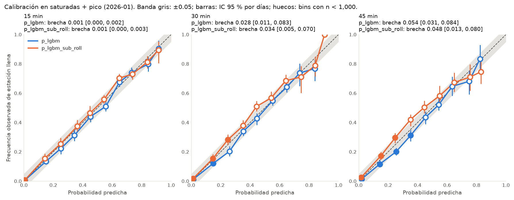
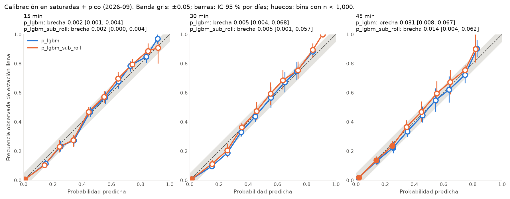

# M6: prueba final en 2026-01 y 2026-09

Paso 8 de [`next_steps.md`](../next_steps.md). **Protocolo registrado el 2026-10-07, antes de leer cualquier etiqueta de los meses de prueba.** Los resultados se agregan abajo sin cambiar esta sección, cumplan o no.

## Protocolo

**Modelo.** El congelado en M6, sin ningún cambio:
- booster LightGBM entrenado en TRAIN, con parada temprana e isotónica global en VAL_FIT;
- Platt por subgrupo en saturadas + pico, reajustado cada semana con los 28 días anteriores, y Platt fijo de VAL_FIT si la ventana tiene < 5,000 filas (`p_lgbm_sub_roll`, `FROZEN`).

`ecobici.eval.test_report` reentrena (es determinista) y **compara byte por byte el booster, la isotónica y el Platt fijo con los artefactos congelados antes de calcular cualquier métrica**. Si algo difiere, se detiene. La lista de estaciones es la de M6: las que solo aparecen en los meses de prueba quedan fuera y se reporta cuántas son.

**Meses:**
- **2026-01, la prueba principal.** Mes completo, cadencia de ~15.5 min como en entrenamiento. Las ventanas semanales salen de VAL_REPORT (diciembre de 2025).
- **2026-09 desde el 11** (`splits.TEST_FROM`), **secundaria y reportada aparte.** Cadencia de 12 min: las etiquetas a 15 / 30 / 45 min se leen a 12 / 24 / 48 min, y su Brier absoluto no se compara con el de 2026-01 ([M2](M2_history.md#2026-09-en-detalle-2026-10-06)). No hay historia antes del 11, así que las primeras semanas usan el Platt fijo. Se reporta qué parte del subgrupo se calibró así.

**Comparación.** Las mismas líneas base, cortes, métricas y bootstrap por días (1,000 réplicas) de M6:
- **referencia fijada de antemano:** la mejor línea base ajustada con TRAIN en cada corte;
- **referencia justa:** la mejor de todas, incluidas `_tvf` e `_iso`.

**Criterios, para `p_lgbm_sub_roll` en 2026-01** (los mismos de M6):

| # | Criterio | Corte | Horizontes |
| --- | --- | --- | --- |
| 1 | BSS > 0 contra la referencia fijada de antemano | los 4 cortes | 15, 30, 45 |
| 2 | BSS ≥ 0.10 | saturadas + pico | 30 |
| 3 | Brecha de calibración ≤ 0.05 (bins con n ≥ 1,000) | saturadas + pico | 15, 30, 45 |

- **Cumple** si los tres criterios se cumplen en el valor puntual.
- **Cumple con holgura** si, además, con el IC 95 % por días, el límite inferior del BSS queda > 0 (≥ 0.10 en el criterio 2) y el superior de la brecha, ≤ 0.05.
- Un mes tiene ~1/3 de las filas de VAL_REPORT, así que menos bins llegan a n ≥ 1,000 y el criterio 3 juzga menos bins. **No se ajusta el umbral.** El diagrama de confiabilidad muestra todos los bins con su IC.

**2026-09** se evalúa con los mismos criterios, como evidencia adicional en temporada de lluvias. Si falla y 2026-01 cumple, se explica la diferencia (cadencia, Platt fijo, lluvia), pero no invalida el resultado.

**`p_lgbm`** (el modelo fijado antes de M6) se reporta al lado, como referencia.

**Después de correr:**
- Se corre **una sola vez**. No se cambia el modelo, los calibradores ni los criterios por lo que salga.
- Si no cumple, se documenta y la siguiente versión del modelo se juzga en la captura propia (paso 9), no en estos meses.
- Cualquier error de código que se encuentre después se corrige, y se reportan los dos resultados.

```sh
uv run python -m ecobici.eval.test_report
```

## Resultados (2026-10-07)

Corrida única, commit `4b2c0eb`. El booster, la isotónica y el Platt fijo coincidieron byte por byte con los congelados en los tres horizontes. Dos estaciones que solo aparecen en los meses de prueba quedaron fuera. Salida completa en [M6_test_output.md](M6_test_output.md).

**Veredicto: cumple en los dos meses.** Todos los criterios se cumplen en el valor puntual. Con holgura en el BSS, pero **no en la calibración** a 30 y 45 min.

### Precisión: confirmada con margen

BSS de `p_lgbm_sub_roll` contra la referencia fijada de antemano (`p_persist_cal` en todos los casos), IC 95 % por días:

| Corte | 2026-01 · 15 / 30 / 45 min | 2026-09 · 15 / 30 / 45 min |
| --- | --- | --- |
| Todas | +0.181 / +0.199 / +0.199 | +0.168 / +0.184 / +0.198 |
| Pico | +0.215 / +0.211 / +0.200 | +0.239 / +0.249 / +0.241 |
| Saturadas | +0.186 / +0.185 / +0.177 | +0.166 / +0.170 / +0.172 |
| **Saturadas + pico** | **+0.238 / +0.229 / +0.217** | **+0.247 / +0.253 / +0.247** |
| IC saturadas + pico | [+0.212, +0.259] / [+0.204, +0.251] / [+0.193, +0.236] | [+0.225, +0.264] / [+0.226, +0.278] / [+0.210, +0.276] |

- **Igual o mejor que en validación** (VAL_REPORT: +0.219 / +0.222 / +0.213 en saturadas + pico).
- **El límite inferior más bajo** en cualquier corte es +0.170 en 2026-01 y +0.155 en 2026-09, lejos de 0. En el criterio 2 (30 min, saturadas + pico) es +0.204, lejos de 0.10.
- **Contra la referencia justa** cambia ≤ 0.003.
- **Log loss** en saturadas + pico, 2026-01: 0.175 / 0.224 / 0.240, contra 0.288 / 0.352 / 0.362 de la persistencia calibrada (34–39 % menos).

### Calibración: cumple, pero el criterio juzgó pocos bins

| | 2026-01 · 15 / 30 / 45 min | 2026-09 · 15 / 30 / 45 min |
| --- | --- | --- |
| Brecha `p_lgbm_sub_roll` (IC por días) | 0.001 [0.000, 0.003] / 0.034 [0.005, 0.070] / 0.048 [0.013, 0.080] | 0.002 [0.000, 0.004] / 0.005 [0.001, 0.057] / 0.014 [0.004, 0.062] |
| Bins con n ≥ 1,000 | 1 / 3 / 3 | 1 / 1 / 3 |
| Brecha `p_lgbm` | 0.001 / 0.028 / 0.054 | 0.002 / 0.005 / 0.031 |

- **Como se advirtió en el protocolo,** un mes tiene ~17 k filas en saturadas + pico. A 15 min solo el bin de "casi seguro no se llena" llega a 1,000 filas, así que la brecha de 0.001 casi no informa. A 30 y 45 min se juzgan los bins 0–2.
- **Con todos los bins** (diagrama abajo), en 2026-01 el modelo congelado **subestima** de 3 a 7 puntos en el rango medio a 30 y 45 min. Por ejemplo, a 30 min, el bin 0.4–0.5 predice 0.44 y se observa 0.51, IC [0.48, 0.55]. `p_lgbm` va en la otra dirección: sobreestima ~5 puntos en el bin 0.2–0.3.
- **Por qué:** en enero, el Platt semanal se ajustó con diciembre, el mes en que el modelo más sobreestimó (VAL_REPORT). Corrige hacia abajo con un mes de retraso y se pasa cuando la actividad vuelve en enero. La calibración de este subgrupo **cambia de un mes a otro** (sobreestima en oct–dic, apenas en enero), y una ventana de 28 días la persigue con retraso.
- **En la prueba, la calibración por subgrupo no aporta:** su BSS queda 0.001–0.003 por debajo de `p_lgbm` en los dos meses. No es una diferencia real (los IC se traslapan casi por completo), pero tampoco la mejora que se vio en VAL_REPORT.
- **En 2026-09,** el 73–75 % de las filas del subgrupo se calibró con el Platt fijo, por falta de historia. En todas las estaciones, V8 sigue sin brechas (ECE ≤ 0.0019).





### Qué significa

- **La precisión del modelo está confirmada fuera de muestra:** ~20–25 % menos error que la mejor alternativa simple, en los dos meses, en temporada seca y de lluvias, y con la cadencia distinta de septiembre.
- **La calibración del subgrupo saturadas + pico queda a ± 5–7 puntos en el rango medio**, con sesgos que cambian de signo de un mes a otro. Para el recomendador, que ordena estaciones, un error así pesa poco. Para mostrarle al usuario "30 % de probabilidad", sí importa.
- **Siguiente paso (no en estos meses):** medir en la captura propia (paso 9) si conviene quedarse con `p_lgbm_sub_roll` o volver a `p_lgbm`. Alternativas: una ventana más corta o un calibrador que use la tendencia reciente del subgrupo. Lo que se elija ahí se juzga en la captura, no aquí.
